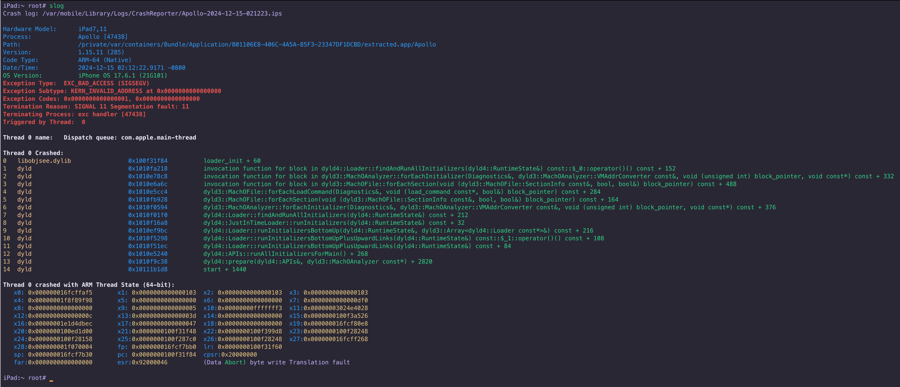

# slog

An iOS crash log symbolication tool for jailbroken devices.

## Usage

Run `slog` to view the latest crash report:

```
iPad:~ root# slog
```

The tool will automatically:
1. Find the most recent .ips crash log in `/var/mobile/Library/Logs/CrashReporter`
2. Symbolicate the crash log
3. Display pretty output with:
   - Incident and device information
   - Exception type and details
   - Crashed thread stack trace

Additional options:

```
Usage: slog [options] [crash_file]
  -i, --ips <file>      Display a specific crash log
  -l, --list            List recent crash logs (default: 15)
  -c  --count <num>     Limit the number of crash logs to list or symbolicate
  -f, --filter <app>    Filter crashes by process name
  -h, --help            Show this help message
```

## Output



```
iPad:~ root# slog
Processing crash log: objsee-2024-12-11-024234.ips

Incident Identifier: 0A0234AB-1DCA-4E82-ABD7-00000
CrashReporter Key:   808f3f6453d8f1e9f46fd3f24c0ac917e900000
Hardware Model:      iPad7,11
Process:             objsee [39868]
Path:                /private/preboot/00000/jb-XqdYf2hT/procursus/usr/bin/objsee
Identifier:          objsee
Version:             ???
Code Type:           ARM-64 (Native)
Role:                Unspecified
Parent Process:      zsh [39198]
Coalition:           com.openssh.sshd.00000-00000-00000-00000-00000 [10241]
Date/Time:           2024-12-11 02:42:33.9803 -0800
Launch Time:         2024-12-11 02:42:33.8020 -0800
OS Version:          iPhone OS 17.6.1 (21G101)
Release Type:        User
Report Version:      104
Exception Type:  EXC_BAD_ACCESS (SIGBUS)
Exception Subtype: KERN_PROTECTION_FAILURE at 0x00000001e1d4af4c
Exception Codes: 0x0000000000000002, 0x00000001e1d4af4c
VM Region Info: 0x1e1d4af4c is in 0x1e1d47000-0x1e1d53000;  bytes after start: 16204  bytes before end: 32947
      REGION TYPE                 START - END      [ VSIZE] PRT/MAX SHRMOD  REGION DETAIL
      __TEXT                   1e1d3e000-1e1d47000 [   36K] r-x/r-x SM=COW  /usr/lib/system/libsystem_dnssd.dylib
--->  __TEXT                   1e1d47000-1e1d53000 [   48K] r-x/r-x SM=COW  /usr/lib/system/libsystem_platform.dylib
      __TEXT                   1e1d53000-1e1dfa000 [  668K] r-x/r-x SM=COW  /usr/lib/system/libcorecrypto.dylib
Termination Reason: SIGNAL 10 Bus error: 10
Terminating Process: exc handler [39868]
Triggered by Thread:  0
Thread 0 name:   Dispatch queue: com.apple.main-thread

Thread 0 Crashed:
0   libsystem_platform.dylib       0x1e1d4af38          _os_unfair_lock_lock_slow + 176
1   CoreSymbolication              0x1b99f4e9c          CSCppSymbolicator::read_timeline(std::__1::function<void (CSCppSymbolOwnerTimeline&)>) + 36
2   CoreSymbolication              0x1b9a26cd0          CSCppSymbolicator::get_symbol_owner_with_address_at_time(unsigned long long, unsigned long long) + 100
3   CoreSymbolication              0x1b9a27564          CSSymbolicatorGetSymbolWithAddressAtTime + 48
4   objsee                         0x1002ad36c          symbolicateThread + 924
5   objsee                         0x1002adf28          main + 2444
6   dyld                           0x10045b228          start + 1520

Thread 0 crashed with ARM Thread State (64-bit):
   x0: 0x00000001e1d4af4c	x1: 0x0000000000000000	x2: 0x0000000000000000	x3: 0x0000000000000103
   x4: 0x0000000000060a28	x5: 0x00000009e8983650	x6: 0x0000000000000013	x7: 0xfffffffffffffe16
   x8: 0x00000000aa1603e0	x9: 0x00000000aa1603e1	x10:0x0000000000060a28	x11:0x0000000000020228
   x12:0x0000000000020228	x13:0x0000000000060a28	x14:0x00000000ffffffff	x15:0x0000000000000000
   x16:0x00000001e1d4daa0	x17:0x0000000000020028	x18:0x0000000000000000	x19:0x0000000000000103
   x20:0x0000000000000000	x21:0x0000000000000000	x22:0x00000001e1d4af4c	x23:0x0000000001000002
   x24:0x00000000aa1603e1	x25:0x0000000000000000	x26:0x00000000ffffffff	x27:0x0000000000000103
   x28:0x0000000000000000	fp: 0x000000016fb567d0	lr: 0x00000001b99f4e9c
   sp: 0x000000016fb56780	pc: 0x00000001e1d4af38	cpsr:0x60000000
   far:0x00000001e1d4af4c	esr:0x9200004f        	(Data Abort) byte write Permission fault

Binary Images:
       0x100424000 -        0x1004a3fff dyld arm64  <3f97036d30e130f08817ade7de64868c> /cores/usr/lib/dyld
       0x1003c4000 -        0x1003cffff 0Cr4shed.dylib arm64  <2e14898dc79837fbafc08d31686cab8b> /private/preboot/00000/jb-XqdYf2hT/procursus/usr/lib/TweakInject/0Cr4shed.dylib
       0x1003e0000 -        0x1003f3fff Cephei arm64  <9a32fd2a1d0c3de6ac49d0897d66d86a> /private/preboot/00000/jb-XqdYf2hT/procursus/Library/Frameworks/Cephei.framework/Cephei
       0x100910000 -        0x100937fff libellekit.dylib arm64  <5e4752c3e4b130ec80176720a34ad2db> /private/preboot/00000/jb-XqdYf2hT/procursus/usr/lib/libellekit.dylib
       0x100318000 -        0x10031ffff systemhook.dylib arm64  <b14375b3e14134dcaaaeb9a3a380e862> /cores/binpack/usr/lib/systemhook.dylib
       0x1002a8000 -        0x1002bbfff objsee arm64  <21100b49efa3302c84807ee39b7d9db1> /private/preboot/00000/jb-XqdYf2hT/procursus/usr/bin/objsee
       0x1e1d47000 -        0x1e1d52ff7 libsystem_platform.dylib arm64  <215a128ef97e37edb518a264388b108e> /usr/lib/system/libsystem_platform.dylib
       0x1b99f1000 -        0x1b9b06fff CoreSymbolication arm64  <80463652b54a3d35b2564c7881c9bace> /System/Library/PrivateFrameworks/CoreSymbolication.framework/CoreSymbolication
               0x0 - 0xffffffffffffffff ??? unknown-arch  <00000000000000000000000000000000> ???
```
